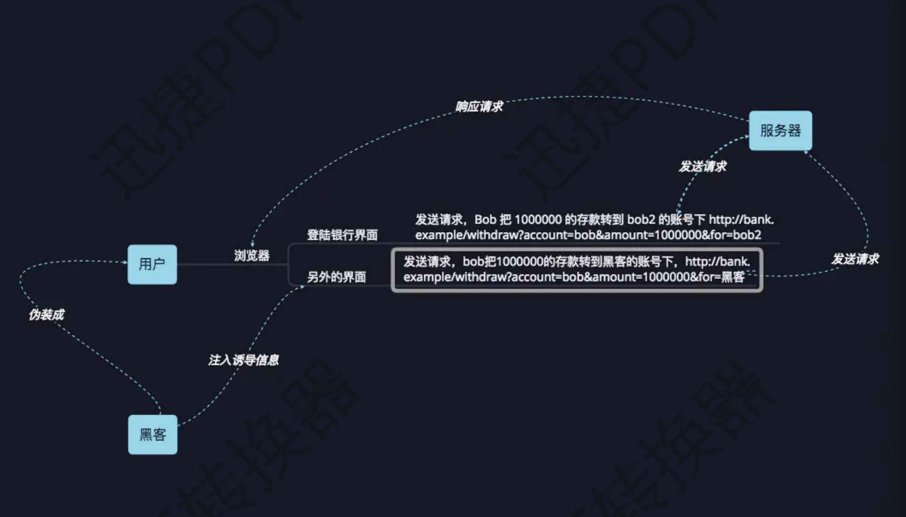

# 1.初识CSRF

CSRF：Cross-site request forgery，跨站请求伪造

简单来说：



**简单**一点的例子：

某个游戏网站的虚拟币转账的url：

`http://www.game.com/Transfer.php?toUserId=11&vMoney=1000`

这时攻击者可以构造一个链接(20为自己的id)：

`http://www.game.com/Transfer.php?toUserId=20&vMoney=1000`

这样当用户点击的时候，浏览器将会携带该游戏网站的cookie进行访问，刷一下就没了1000游戏虚拟币


**中级**一点的例子：

不再是GET方式提交，而是改为表单提交数据

但是，假若后台的接收代码大致：

```php
<?php
 　　　　session_start();
 　　　　if (isset($_REQUEST['toUserId'] &&　isset($_REQUEST['vMoney']))  #验证
 　　　　{
 　　　　     //相应的转账操作
 　　　　}
?>
```

那么上述的攻击依旧奏效。

开发人员没有使用\$\_POST进行接收数据。**\$\_REQUEST可以接收POST和GET发来的数据**，因此漏洞就产生了。


**高级**一点的例子：

这时开发人员使用POST来接收数据

这时攻击者可以伪造了一份一模一样的转账表单，并且嵌入到iframe中，当用户点击时，依旧可以奏效


感性的理解了CSRF，下面用代码来理解下，源自i春秋的bbs


# 2.代码层次理解CSRF

先空着，之后再写

